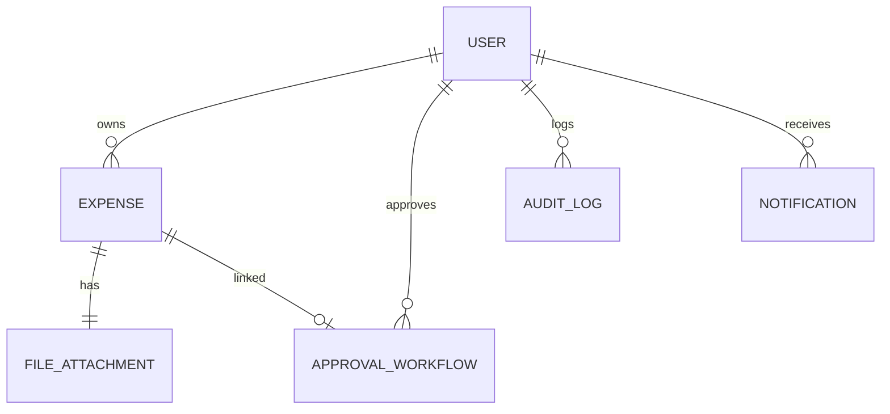

# 🏢 Enterprise Expense Management System

## 📌 Overview  
The **Enterprise Expense Management System** is designed to help organizations efficiently **track, manage, and analyze employee expenses**. It features **role-based authentication**, **expense categorization**, **multi-level approval workflows**, and **real-time analytics**.

---

## 🛠️ Tech Stack  
### **🔹 Backend (Spring Boot)**
- Spring Boot (REST API)
- Spring Security (JWT Authentication)
- Spring Data JPA (Hibernate ORM)
- Flyway (Database Migrations)
- Lombok (Boilerplate Reduction)
- OpenAPI/Swagger (API Documentation)

### **🔹 Database (PostgreSQL/MySQL)**
- Relational Database (PostgreSQL/MySQL)
- Entity Relationship Design
- Stored Procedures & Triggers

### **🔹 Frontend (React or Angular)**
- React.js (with Redux Toolkit) **OR** Angular (with RxJS)
- Material UI / Angular Material
- Axios (API Calls)
- Chart.js / D3.js (Analytics)

---

## 📊 Progress So Far: **Database Schema & Model Classes**
### **📝 Implemented Model Classes**
The database schema follows **relational database principles** and is structured as follows:

| Entity | Relationship |
|--------|-------------|
| **User** | One-to-Many with **Expense** |
| **Role** | Enum (`EMPLOYEE`, `MANAGER`, `ADMIN`) |
| **Expense** | Many-to-One with **User**, One-to-One with **FileAttachment** |
| **ExpenseCategory** | Enum (`TRAVEL`, `FOOD`, `OFFICE_SUPPLIES`, etc.) |
| **Approval Workflow** | One-to-One with **Expense**, Many-to-One with **User** (Approver) |
| **Audit Log** | Many-to-One with **User** |
| **Notification** | Many-to-One with **User** (Recipient) |
| **FileAttachment** | One-to-One with **Expense** (For invoices) |

---

### **📌 Database Schema Diagram**


## 🔒 Backend Progress: **Authentication & Core Features**

### **📝 Implemented Features**

#### **🔐 Authentication System**
- **JWT-based Authentication**: Secure token-based authentication system
- **Role-based Authorization**: Implemented EMPLOYEE, MANAGER, and ADMIN roles
- **OAuth2 Support**: Added provider-based authentication (optional)
- **Password Encryption**: BCrypt password hashing
- **Token Management**: JWT generation, validation, and refresh mechanisms

#### **👤 User Management**
- **User Registration**: Complete signup flow with email verification
- **Profile Management**: CRUD operations for user profiles
- **Role Assignment**: Dynamic role assignment capabilities
- **Password Reset**: Secure password recovery system

#### **💼 Database Migrations**
- **Flyway Integration**: Implemented database version control
- **Schema Updates**: Added nullable provider column for OAuth support
- **Data Consistency**: Maintained referential integrity across tables

### **🔄 API Endpoints**

#### **Authentication APIs**
```http
POST /api/v1/auth/register     # User registration
POST /api/v1/auth/login        # User login
POST /api/v1/auth/refresh      # Refresh token
POST /api/v1/auth/logout       # User logout
```

#### **User Management APIs**
```http
GET    /api/v1/users          # Get all users (ADMIN)
GET    /api/v1/users/{id}     # Get user by ID
PUT    /api/v1/users/{id}     # Update user
DELETE /api/v1/users/{id}     # Delete user (ADMIN)
```

### **🔨 Technical Implementation**

#### **Security Configuration**
- Implemented `SecurityConfig` with JWT filter chain
- Configured CORS and CSRF protection
- Set up role-based endpoint access control

#### **Service Layer**
- `AuthService`: Handles authentication logic
- `UserService`: Manages user operations
- `JwtService`: Token generation and validation
- `ValidationService`: Input validation and sanitization

#### **Database Layer**
- Implemented JPA repositories
- Created database migration scripts
- Optimized query performance

### **🧪 Testing**
- Unit tests for services
- Integration tests for controllers
- Security testing for authentication flow
- Database migration tests

---

## 🚀 Next Steps
1. **Expense Management Implementation**
   - Create expense submission endpoints
   - Implement approval workflow logic
   - Add file attachment handling

2. **Notification System**
   - Set up email notifications
   - Implement in-app notifications
   - Add real-time updates

3. **Reporting & Analytics**
   - Create expense reporting endpoints
   - Implement data aggregation
   - Add export functionality

---

## 🛠️ Setup & Installation
[Coming Soon]

---

## 📝 API Documentation
[Coming Soon]
